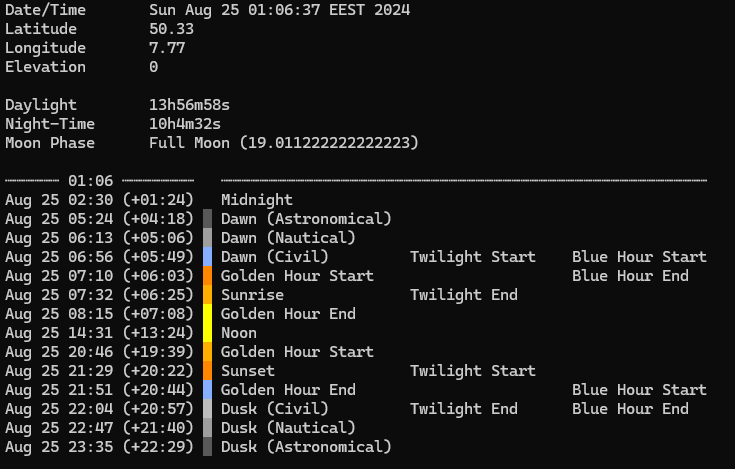

# Celestial 
[](https://goreportcard.com/report/github.com/interimme/celestial)

Celestial is a Go package for calculating the positions of the sun and moon with accurate timings for solar and lunar events. This library is ideal for developers needing precise astronomical calculations for various applications such as sunrise, sunset, moon phases, and more.

## Features

- **Solar Calculations**: Calculate sunrise, sunset, noon, dawn, dusk, and twilight times.
- **Lunar Calculations**: Determine moonrise, moonset, and various moon phases.
- **Position Calculations**: Compute the solar and lunar positions (elevation and azimuth).
- **Accurate Timings**: Supports adjustments for observer elevation and atmospheric refraction for precise results.

## CLI

Celestial comes with a command-line interface (CLI) that allows you to easily calculate astronomical events. Here's a screenshot showing how to use the CLI:



## Installation

### Homebrew

Install Celestial using Homebrew:

```bash
brew install interimme/tap/celestial
```

### Manually

To install Celestial manually, use `go get`:

```bash
go get -u github.com/interimme/celestial/cmd/celestial
```

## Usage

After installation, you can use Celestial to calculate various astronomical events. Here are the command-line options:

```bash
Usage of celestial:
  -elev float
        Elevation of the observer
  -lat float
        Latitude of the observer
  -long float
        Longitude of the observer
  -time string
        Day/time used for the calculation (defaults to current time)
```

## Example

Here is an example of how to use Celestial to calculate sunrise and sunset times:

```bash
$ celestial -lat 50.33 -long 7.77
Date/Time       Sun Aug 25 01:06:37 EEST 2024
Latitude        50.33
Longitude       7.77
Elevation       0

Daylight        13h56m58s
Night-Time      10h4m32s
Moon Phase      Full Moon (19.011222222222223)

┈┈┈┈┈┈ 01:06 ┈┈┈┈┈┈┈┈   ┈┈┈┈┈┈┈┈┈┈┈┈┈┈┈┈┈┈┈┈┈┈┈┈┈┈┈┈┈┈┈┈┈┈┈┈┈┈┈┈┈┈┈┈┈┈┈┈┈┈┈┈┈┈
Aug 25 02:30 (+01:24)   Midnight
Aug 25 05:24 (+04:18)   Dawn (Astronomical)
Aug 25 06:13 (+05:06)   Dawn (Nautical)
Aug 25 06:56 (+05:49)   Dawn (Civil)         Twilight Start    Blue Hour Start
Aug 25 07:10 (+06:03)   Golden Hour Start                      Blue Hour End
Aug 25 07:32 (+06:25)   Sunrise              Twilight End
Aug 25 08:15 (+07:08)   Golden Hour End
Aug 25 14:31 (+13:24)   Noon
Aug 25 20:46 (+19:39)   Golden Hour Start
Aug 25 21:29 (+20:22)   Sunset               Twilight Start
Aug 25 21:51 (+20:44)   Golden Hour End                        Blue Hour Start
Aug 25 22:04 (+20:57)   Dusk (Civil)         Twilight End      Blue Hour End
Aug 25 22:47 (+21:40)   Dusk (Nautical)
Aug 25 23:35 (+22:29)   Dusk (Astronomical)
```

## Contributing

Contributions are welcome! Please feel free to submit a Pull Request or open an issue.
